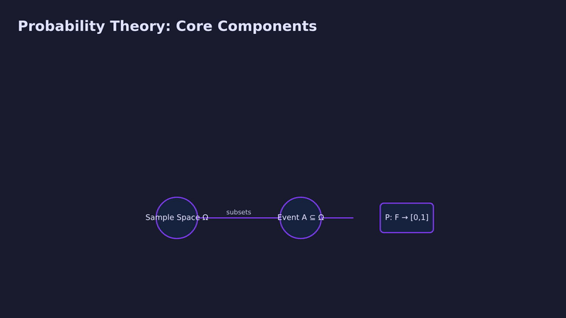

# learnflow-ai

**[Live demo → trylearnflow.vercel.app](https://trylearnflow.vercel.app)**

Turn any PDF (lecture notes, a paper, documentation) into a narrated explainer video with animated slides, an auto-generated comprehension quiz, and an automated benchmark of how well the narration alone teaches the material compared to giving an LLM the full source text.



## How it works

```text
PDF → Claude (script + slide structure) → ElevenLabs (TTS) → Remotion (video render)
                                                                      ↓
                                              Claude (quiz) → user answers → eval + focus areas
```

1. **Upload a PDF.** Text is extracted and sent to Claude, which produces a structured narration script: 5-8 slides, each with a title, spoken narration, bullet points, and — for slides where the content actually calls for it — an animated visual (see below).
2. **Narration is synthesized** per slide via ElevenLabs, and each slide's on-screen duration is driven by its real audio length, not a fixed timer.
3. **The video is rendered** with Remotion, slides and narration in sync.
4. **A quiz is generated** — 3 to 8 multiple-choice questions, scaled to how dense the source material is, written to require reasoning rather than memorized recall.
5. **After you answer, an eval runs automatically**: the same quiz is answered twice more, once by an LLM given only the narration script and once by an LLM given the full source PDF text, to measure how much the narration format itself costs (or doesn't cost) in comprehension. Wrong answers get a focus-areas writeup naming the specific concepts to review.

## Animated visual slides

Beyond plain title-and-bullets slides, Claude chooses per-slide whether the content calls for an animated visual — a **bar chart** for comparing named quantities, or a **diagram** for spatial/relational structure — and supplies the real data for it. Everything is rendered as pure SVG animated with Remotion's spring physics, no charting library, in a shared navy/violet theme. Two additional templates (curve plots and annotated formulas) exist end-to-end in the codebase but are currently disabled — see [Known Limitations](#known-limitations).

Two independent layers keep this safe: a pydantic model validates and normalizes every visual payload before it ever reaches the renderer, and a React error boundary wraps each visual component so any unexpected runtime failure degrades that one slide to plain bullets instead of breaking the render.

## A real eval result

From an actual run against a probability/security-risk lecture PDF, on a 5-question quiz:

| Context given to the LLM | Score |
|---|---|
| Narration script only | **5 / 5** |
| Full source PDF text | **4 / 5** |

The full-source run missed a question requiring the expected-value calculation for a fair die — narration-only got it right. This is the actual point of the eval: it's not a foregone conclusion that more context means better comprehension, and this project measures that instead of assuming it.

## Tech stack

| Layer | Technology |
|---|---|
| Backend | Python / FastAPI, rate-limited with slowapi |
| PDF parsing | pdfplumber |
| Script + quiz + eval generation | Claude API (Anthropic), Sonnet for generation, Haiku for focus-area analysis |
| TTS | ElevenLabs |
| Video rendering | Remotion (React / TypeScript), KaTeX for math typesetting |
| Frontend | Vite + React + TypeScript + Tailwind |
| Deployment | Docker on Google Cloud Run (backend), Vercel (frontend) |

## Deployment notes

The backend and Remotion renderer ship as a single Docker image (see `Dockerfile`) — Node, the Chrome headless shell Remotion needs, ffmpeg, and Python all in one container, running on Cloud Run's `linux/amd64` hardware. This sidesteps a real local-dev problem: Windows-on-ARM has no native Chrome headless shell build, so this same render step only works locally via a WSL2 workaround — the deployed container needs none of that, since it's just a standard Linux environment.

Cloud Run runs with `--no-cpu-throttling` (the render happens in a FastAPI background task after the HTTP response returns, so it needs CPU available outside the request/response cycle) and `--max-instances=1` (keeps the in-memory job store and per-IP rate limiter coherent without needing external state).

## Known Limitations

- **`formula` and `curve_plot` visual types are temporarily disabled.** Both are fully implemented — pydantic validation, the Remotion component, the sanitizer's fallback path — but real rendered output still showed visible bugs (mispositioned annotation leader-lines for `formula`; layout errors for `curve_plot`) that weren't fully resolved in a debugging session. Both are removed from the prompt's available options for now, so that content falls back to plain bullets instead of shipping a visibly broken visual. Re-enabling either is restoring a few lines of prompt text in `backend/script_generator.py` (see the comment above `_VISUAL_MODELS`) once the underlying bug is actually fixed.
- Rendering requires either Docker or WSL2 locally on Windows (see above) — there's no native Windows-ARM render path.

## Local Development

Requires `ANTHROPIC_API_KEY` and `ELEVENLABS_API_KEY` (see `backend/.env.example`).

### Backend

```bash
cd backend
pip install -r requirements.txt
python -m uvicorn main:app --reload
```

### Frontend

```bash
cd frontend
npm install
npm run dev
```

### Render (Remotion)

```bash
cd render
npm install
npx remotion studio src/index.ts
```

Rendering a real video locally on Windows needs WSL2 (native Chrome headless shell isn't available on Windows) or Docker — see `Dockerfile` for the exact environment the deployed backend uses.

### Eval (standalone)

```bash
cd eval
python eval.py
```
